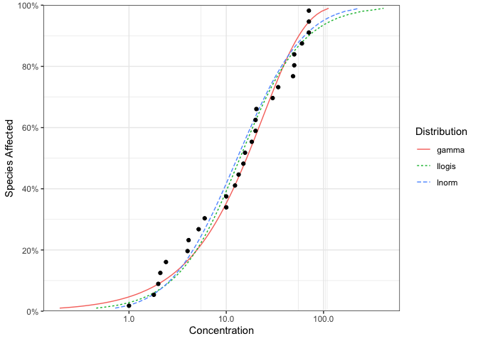

<!-- README.md is generated from README.Rmd. Please edit that file -->

# ssdtools 

[](https://github.com/BCDevExchange/docs/blob/master/discussion/projectstates.md)
[](https://travis-ci.org/bcgov/ssdtools)
[](https://codecov.io/github/bcgov/ssdtools?branch=master)
[](https://cran.r-project.org/package=ssdtools)

[](https://doi.org/10.21105/joss.01082)

`ssdtools` is an R package to plot and fit Species Sensitivity
Distributions (SSD).

SSDs are cumulative probability distributions which are fitted to
toxicity concentrations for multiple species. The ssdtools package uses
Maximum Likelihood to fit log-normal, log-logistic, log-Gumbel,
Gompertz, gamma or Weibull distributions. Multiple distributions can be
averaged using Information Criteria. Confidence intervals on fits and
hazard concentrations are produced by bootstrapping.

## Installation

To install the latest version from
[CRAN](https://CRAN.R-project.org/package=ssdtools)

``` r
install.packages("ssdtools")
```

To install the latest development version:

``` r
install.packages("devtools")
devtools::install_github("bcgov/ssdtools")
```

## Introduction

`ssdtools` provides a data set for several chemicals including Boron.

``` r
library(ssdtools)
boron_data
#> # A tibble: 28 x 5
#>    Chemical Species                  Conc Group        Units
#>    <chr>    <chr>                   <dbl> <fct>        <chr>
#>  1 Boron    Oncorhynchus mykiss       2.1 Fish         mg/L 
#>  2 Boron    Ictalurus punctatus       2.4 Fish         mg/L 
#>  3 Boron    Micropterus salmoides     4.1 Fish         mg/L 
#>  4 Boron    Brachydanio rerio        10   Fish         mg/L 
#>  5 Boron    Carassius auratus        15.6 Fish         mg/L 
#>  6 Boron    Pimephales promelas      18.3 Fish         mg/L 
#>  7 Boron    Daphnia magna             6   Invertebrate mg/L 
#>  8 Boron    Opercularia bimarginata  10   Invertebrate mg/L 
#>  9 Boron    Ceriodaphnia dubia       13.4 Invertebrate mg/L 
#> 10 Boron    Entosiphon sulcatum      15   Invertebrate mg/L 
#> # … with 18 more rows
```

Multiple distributions can be fit using `ssd_fit_dists()`

``` r
boron_dists <- ssd_fit_dists(boron_data)
```

and plot using the `ggplot2` generic `autoplot`

``` r
library(ggplot2)
theme_set(theme_bw())
autoplot(boron_dists)
```

<!-- -->

The goodness of fit can be assessed using `ssd_gof`

``` r
ssd_gof(boron_dists)
#> # A tibble: 6 x 9
#>   dist        ad     ks    cvm   aic  aicc   bic delta weight
#> * <chr>    <dbl>  <dbl>  <dbl> <dbl> <dbl> <dbl> <dbl>  <dbl>
#> 1 gamma    0.441 0.117  0.0555  238.  238.  240. 0.019  0.268
#> 2 gompertz 0.602 0.120  0.0823  238.  238.  240. 0      0.271
#> 3 lgumbel  0.829 0.158  0.134   244.  245.  247. 6.58   0.01 
#> 4 llog     0.487 0.0993 0.0595  241.  241.  244. 3.40   0.049
#> 5 lnorm    0.507 0.107  0.0703  239.  240.  242. 1.42   0.133
#> 6 weibull  0.435 0.117  0.0543  238.  238.  240. 0.014  0.269
```

and the model-averaged 5% hazard concentration estimated using `ssd_hc`

``` r
boron_hc5 <- ssd_hc(boron_dists, nboot = 10000)
```

``` r
print(boron_hc5)
#> # A tibble: 1 x 5
#>   percent   est    se   lcl   ucl
#>     <int> <dbl> <dbl> <dbl> <dbl>
#> 1       5  1.25 0.736 0.604  3.20
```

Model-averaged predictions complete with confidence intervals can be
produced using the `stats` generic `predict`

``` r
boron_pred <- predict(boron_dists)
```

and plotted together with the original data using `ssd_plot`.

``` r
ssd_plot(boron_data, boron_pred, shape = "Group", color = "Group", label = "Species",
         xlab = "Concentration (mg/L)", ribbon = TRUE) + expand_limits(x = 3000)
```

<!-- -->

## Information

The ssdtools manual is available at
<https://bcgov.github.io/ssdtools/articles/ssdtools-manual.html>.

A shiny webpage developed for non-R-users is available at
<https://poissonconsulting.shinyapps.io/ssdtools/>.

The ssdtools package was developed as a result of earlier drafts of:

Schwarz, C., and Tillmanns, A. 2019. Improving Statistical Methods for
Modeling Species Sensitivity Distributions. Province of British
Columbia, Victoria, BC. Available from
<http://a100.gov.bc.ca/appsdata/acat/documents/r57400/2_1568399094009_8398900200.pdf>.

The CCME `data.csv` data file is derived from a factsheet prepared by
the [Canadian Council of Ministers of the
Environment](http://ceqg-rcqe.ccme.ca/en/index.html). See the
[`data-raw`](https://github.com/bcgov/ssdtools/tree/master/data-raw)
folder for more information.

## Getting Help or Reporting an Issue

To report bugs/issues/feature requests, please file an
[issue](https://github.com/bcgov/ssdtools/issues/).

## Citation

``` 

To cite ssdtools in publications use:

  Thorley, J. and Schwarz C., (2018). ssdtools An R package to fit
  Species Sensitivity Distributions. Journal of Open Source Software,
  3(31), 1082. https://doi.org/10.21105/joss.01082

A BibTeX entry for LaTeX users is

  @Article{,
    title = {{ssdtools}: An R package to fit Species Sensitivity Distributions},
    author = {Joe Thorley and Carl Schwarz},
    journal = {Journal of Open Source Software},
    year = {2018},
    volume = {3},
    number = {31},
    pages = {1082},
    doi = {10.21105/joss.01082},
  }
```

## How to Contribute

If you would like to contribute to the package, please see our
[CONTRIBUTING](CONTRIBUTING.md) guidelines.

Please note that this project is released with a [Contributor Code of
Conduct](CODE_OF_CONDUCT.md). By participating in this project you agree
to abide by its terms

## License

The code is released under the Apache License 2.0

    Copyright 2015 Province of British Columbia
    
    Licensed under the Apache License, Version 2.0 (the "License");
    you may not use this file except in compliance with the License.
    You may obtain a copy of the License at 
    
       http://www.apache.org/licenses/LICENSE-2.0
    
    Unless required by applicable law or agreed to in writing, software
    distributed under the License is distributed on an "AS IS" BASIS,
    WITHOUT WARRANTIES OR CONDITIONS OF ANY KIND, either express or implied.
    See the License for the specific language governing permissions and
    limitations under the License.
